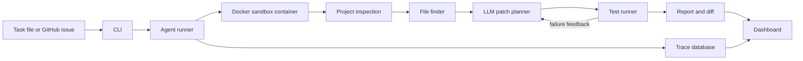

# Software Maintenance Agent

Software Maintenance Agent is a local tool for small, testable software fixes. It takes a task, runs the project in an isolated sandbox, selects likely files, plans a focused patch with an LLM (or a deterministic fallback), reruns tests until they pass, and writes a report.

## Quick Start

```bash
python -m pip install -e ".[dev]"
python -m software_maintaince_agent.cli run --task examples/tasks/python_email_empty.json --sandbox docker
python -m software_maintaince_agent.cli dashboard --port 8765
```

Open `http://127.0.0.1:8765` after starting the dashboard.

## Architecture



## Sandboxes

| Kind | Isolation | Use for |
|---|---|---|
| `docker` (default) | Per-run container, resource limits, network disconnected after dependency install | Any local path or git URL |
| `local` | Directory copy + command allowlist only | Trusted bundled fixtures |
| `e2b` | Not enabled in this build; records a blocker | Escalation-path proof |

The Docker sandbox builds a small `ama-sandbox:py312-node` image on first use (python 3.12, pytest, node, typescript, git, ripgrep), materializes the repository (local copy or shallow `git clone` for URLs), installs dependencies while the container still has network access, then disconnects the network before any agent command runs. Every command additionally passes the same allowlist policy used by the local sandbox.

Python repos verify with pytest; Node/TypeScript repos verify with `npm test`/`npm run lint` (dependencies auto-installed when the task's focused command needs npm) or standalone `npx tsc --noEmit <file>` / `node --check <file>` checks that need no install.

## Patch planning

- With `GEMINI_API_KEY` set, patches are planned by Gemini (`AMA_GEMINI_MODEL`, default `gemini-2.5-flash`): the agent sends the issue, the selected file contents, and the failing test output, and applies the returned file changes. Failed attempts feed their test output back into the next attempt.
- Without a key (or if the API fails), the agent falls back to the deterministic patcher that handles the bundled fixtures, and records the fallback in the trace.
- All patches are path-validated: blocked paths and paths outside the task's allowed globs are refused before anything is written.

## Included Pieces

- Command line tools for running a task, viewing a trace, starting the dashboard, and running the benchmark.
- Docker sandbox with per-run containers and network isolation; local sandbox for trusted fixtures.
- Basic project inspection for Python repositories.
- File selection from issue text, logs, paths, and code content.
- Gemini-backed patch planning with a repair loop and a deterministic fallback.
- Test execution with command checks and path limits.
- Markdown reports, patch diffs, JSON run files, and SQLite traces.
- A browser dashboard for starting runs and reviewing results.

## Example Run

```bash
python -m software_maintaince_agent.cli run --task examples/tasks/python_email_repair.json --sandbox docker
```

The example task copies the fixture project into `runs/`, reproduces the failing test in the sandbox container, patches the validator, reruns tests, and writes:

- `final_report.md`
- `patch.diff`
- `trace.sqlite`
- run details as JSON

## Publishing patches

```bash
python -m software_maintaince_agent.cli run --task <task.json> --sandbox docker --create-pr
```

After a successful run against a remote repository, `--create-pr` pushes the patch to a fresh `ama/<run_id>` branch (never the default branch) and opens a **draft** pull request via the `gh` CLI when it is authenticated. The branch push and PR URL are recorded in the run trace and `publish.json`.

## Benchmark

```bash
python -m software_maintaince_agent.cli benchmark --suite benchmark/suites/mvp.json
```

The benchmark checks whether the file finder selects the expected files for the included tasks.

## Safety

- Secrets are read from environment variables only.
- `.env*`, `runs/`, caches, and local temp files are ignored.
- Agent commands run inside a network-disconnected container (docker sandbox) and are checked against an allowlist before they run.
- File changes are limited to allowed paths from the task.
- Failed or blocked runs still produce a report.

## Configuration

| Variable | Purpose | Default |
|---|---|---|
| `GEMINI_API_KEY` | Enables LLM patch planning | unset (deterministic fallback) |
| `AMA_GEMINI_MODEL` | Gemini model id | `gemini-2.5-flash` |
| `AMA_DOCKER_IMAGE` | Sandbox image override | `ama-sandbox:py312` |
| `AMA_MAX_ATTEMPTS` | Repair-loop attempts | task-defined (1-5) |

## Requirements

- Python 3.11 or newer
- Docker Desktop (for the default sandbox)
- `pytest` for local tests
