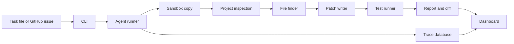

# Software Maintenance Agent

Software Maintenance Agent is a local tool for small, testable software fixes. It takes a task, runs the project in a sandbox copy, selects likely files, applies a focused patch, reruns tests, and writes a report.

## Quick Start

```bash
python -m pip install -e ".[dev]"
python -m software_maintaince_agent.cli run --task examples/tasks/python_email_empty.json --sandbox local
python -m software_maintaince_agent.cli dashboard --port 8765
```

Open `http://127.0.0.1:8765` after starting the dashboard.

## Architecture



## Included Pieces

- Command line tools for running a task, viewing a trace, starting the dashboard, and running the benchmark.
- A local sandbox for trusted fixture projects.
- Basic project inspection for Python repositories.
- File selection from issue text, logs, paths, and code content.
- A deterministic patch path for the included email validation fixture.
- Test execution with command checks and path limits.
- Markdown reports, patch diffs, JSON run files, and SQLite traces.
- A browser dashboard for starting fixture runs and reviewing results.

## Example Run

```bash
python -m software_maintaince_agent.cli run --task examples/tasks/python_email_empty.json --sandbox local
```

The example task copies the fixture project into `runs/`, reproduces the failing test, patches the validator, reruns tests, and writes:

- `final_report.md`
- `patch.diff`
- `trace.sqlite`
- run details as JSON

## Benchmark

```bash
python -m software_maintaince_agent.cli benchmark --suite benchmark/suites/mvp.json
```

The benchmark checks whether the file finder selects the expected files for the included tasks.

## Safety

- Secrets are read from environment variables only.
- `.env*`, `runs/`, caches, and local temp files are ignored.
- Commands are checked before they run.
- File changes are limited to allowed paths from the task.
- Failed or blocked runs still produce a report.

## Requirements

- Python 3.11 or newer
- `pytest` for local tests
